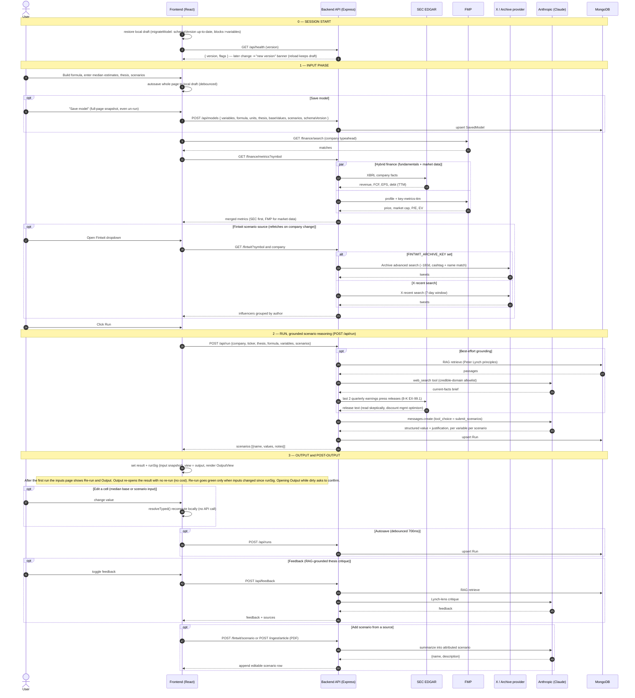

# SZN — Run Flow Sequence Diagram

Canonical UML-style sequence diagram for the full path from filling out the
inputs, clicking **Run**, through the outputs view and everything reachable from
there. GitHub renders the Mermaid block below inline.

> **Maintenance:** keep this in sync with the code. Whenever the run/grounding,
> finance, Fintwit, or output flow changes, update this diagram in the same
> commit.

_Last updated: 2026-07-23 (rev 2 — versioning/draft, save-everything, output/re-run buttons)_

## Notes

- **Grounding is best-effort:** RAG, web search, and the earnings-release fetch
  each fail open — the run continues ungrounded rather than erroring.
- **Hybrid finance:** fundamentals come from SEC EDGAR (primary-source filings);
  FMP supplies company search plus the market data SEC has no access to (price,
  market cap, P/E, enterprise value).
- **Fintwit reach:** X recent search is capped at 7 days on every plan; a
  third-party archive provider (`FINTWIT_ARCHIVE_KEY`) extends it to ~180 days.
- **Recalculation** on cell edits is local (`resolveTyped`) — no API round-trip.
- **Schema versioning** — every saved model/run carries `schemaVersion`; `migrateModel` upgrades old data on load (e.g. `blocks`→`variables`), so a patched bug can't re-enter through a stale saved model.
- **Draft + deploy resilience** — the whole in-progress page is autosaved to a local draft and restored on load, so a reload (including after a new deploy) never clears un-run work; a version change surfaces a non-disruptive reload banner.
- **Save model** now stores the full page snapshot (structure + median estimates + scenarios), not just the template.
